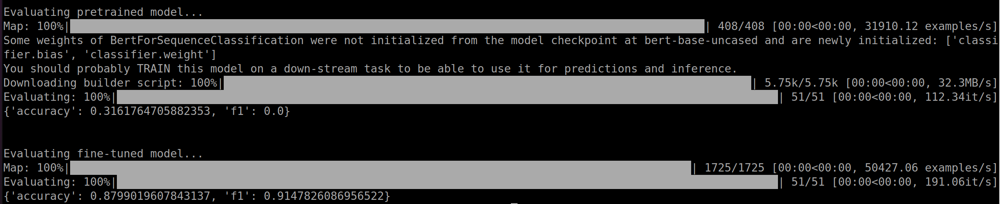

# Finetune hugging face transformer

## 1. Update docker images
```bash
source ~/huggingface-notebooks/Docker/gpu/pull.sh
```

## 2. Run docker images
```bash
source ~/huggingface-notebooks/gpu_run.sh
```

## 3. Enter the directory of finetuning chapter
```bash
cd ~/huggingface-notebooks/course/en/chapter3/finetune_transformer
```

## 4. Download dataset and tokenizer on local machine
Ensure the required datasets and tokenizers are available locally for fine-tuning by executing the commands below. These steps allow for the selection between the "mrpc" and "sst2" configurations of the GLUE dataset.
### 4.1. Download "glue" "mrpc" dataset and bert-base-uncased tokenizer
To use the default configuration ("mrpc"):
```bash
python3 download.py --checkpoint bert-base-uncased --dataset_name glue --dataset_config mrpc
```
### 4.2. Download "glue" "sst2" dataset and bert-base-uncased tokenizer
To switch to the "sst2" configuration:
```bash
python3 download.py --checkpoint bert-base-uncased --dataset_name glue --dataset_config sst2
```
This ensures the necessary datasets and tokenizers are pre-downloaded for the specified configurations.

## 5. Finetune (with accelerating) and save hugging face transformer model
Use the Accelerate library for efficient fine-tuning of the model on your selected dataset configuration. The following commands initiate the fine-tuning process and save the trained model.
### 5.1. Finetune bert-base-uncased model on "glue" "mrpc" (default) dataset
For the default "mrpc" configuration:
```bash
accelerate launch train.py --checkpoint bert-base-uncased --dataset_config mrpc --saved_model_path saved_models/bert_mrpc --num_epochs 3 --batch_size 8
```
### 5.2. Finetune bert-base-uncased model on "glue" "sst2" dataset
For the "sst2" dataset configuration:
```bash
accelerate launch train.py --checkpoint bert-base-uncased --dataset_config sst2 --saved_model_path saved_models/bert_sst2 --num_epochs 3 --batch_size 8
```
These commands will start the fine-tuning process with specified epochs and batch size, saving the trained models in the designated paths.

## 6. Evaluate finetuned hugging face transformer model
After fine-tuning, assess the model's performance using the evaluation script. This step helps in comparing the accuracy before and after the fine-tuning process.
### 6.1. Evaluate on "glue" "mrpc" dataset
To evaluate the fine-tuned model on the "sst2" dataset:
```bash
python3 eval.py --checkpoint bert-base-uncased --dataset_config mrpc --model_path saved_models/bert_mrpc --batch_size 8
```
Evaluation result: before finetuning (accuracy = 32%) vs. after finetuning (accuracy = 88%)


### 6.2. Evaluate on "glue" "sst2" dataset
To evaluate the fine-tuned model on the "sst2" dataset:
```bash
python3 eval.py --checkpoint bert-base-uncased --dataset_config sst2 --model_path saved_models/bert_sst2 --batch_size 8
```
Evaluation result: before finetuning (accuracy = 49%) vs. after finetuning (accuracy = 93%)


