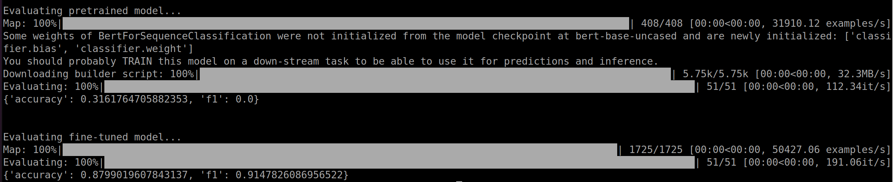

# Finetune hugging face transformer

## 1. Update docker images
```bash
source ~/huggingface-notebooks/Docker/gpu/pull.sh
```

## 2. Run docker images
```bash
source ~/huggingface-notebooks/gpu_run.sh
```

## 3. Enter the directory of finetuning chapter
```bash
cd ~/huggingface-notebooks/course/en/chapter3/finetune_transformer
```

## 4. Download dataset and tokenizer on local machine
```bash
python3 download.py
```

## 5. Finetune (with accelerating) and save hugging face transformer model
```bash
accelerate launch train.py
```

## 6. Evaluate finetuned hugging face transformer model
```bash
python3 eval.py
```

Evaluation result: before finetuning (accuracy = 32%) vs. after finetuning (accuracy = 88%)
